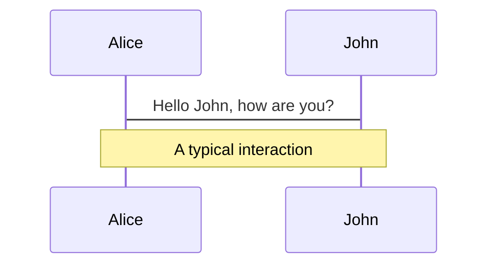
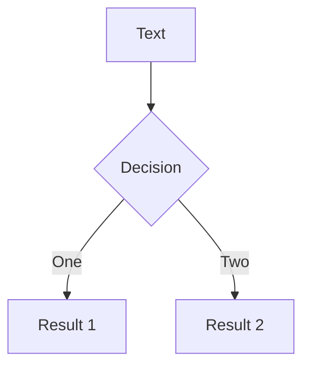
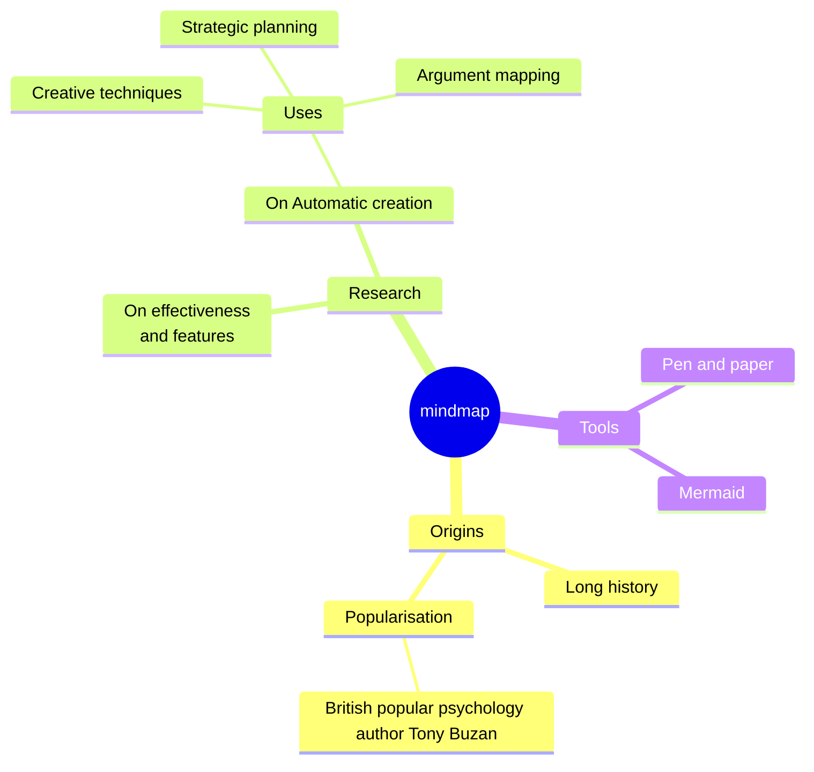
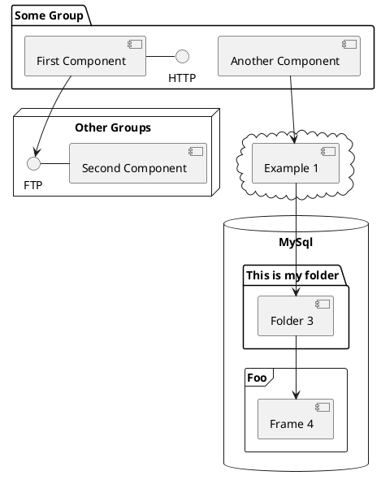

---
# You can also start simply with 'default'
theme: seriph
# random image from a curated Unsplash collection by Anthony
# like them? see https://unsplash.com/collections/94734566/slidev
background: https://cover.sli.dev
# some information about your slides (markdown enabled)
title: Welcome to Slidev
info: |
  ## Slidev Starter Template
  Presentation slides for developers.

  Learn more at [Sli.dev](https://sli.dev)
# apply unocss classes to the current slide
class: text-center
# https://sli.dev/features/drawing
drawings:
  persist: false
# slide transition: https://sli.dev/guide/animations.html#slide-transitions
transition: slide-left
# enable MDC Syntax: https://sli.dev/features/mdc
mdc: true
# open graph
seoMeta:
  # By default, Slidev will use ./og-image.png if it exists,
  # or generate one from the first slide if not found.
  ogImage: auto
  # ogImage: https://cover.sli.dev
---

# Welcome to Slidev

Presentation slides for developers

<div @click="$slidev.nav.next" class="mt-12 py-1" hover:bg="white op-10">
  Press Space for next page <carbon:arrow-right />
</div>

<div class="abs-br m-6 text-xl">
  <button @click="$slidev.nav.openInEditor()" title="Open in Editor" class="slidev-icon-btn">
    <carbon:edit />
  </button>
  <a href="https://github.com/slidevjs/slidev" target="_blank" class="slidev-icon-btn">
    <carbon:logo-github />
  </a>
</div>

<!--
The last comment block of each slide will be treated as slide notes. It will be visible and editable in Presenter Mode along with the slide. [Read more in the docs](https://sli.dev/guide/syntax.html#notes)
-->

---
transition: fade-out
---

# What is Slidev?

Slidev is a slides maker and presenter designed for developers, consist of the following features

- 📝 **Text-based** - focus on the content with Markdown, and then style them later
- 🎨 **Themable** - themes can be shared and re-used as npm packages
- 🧑‍💻 **Developer Friendly** - code highlighting, live coding with autocompletion
- 🤹 **Interactive** - embed Vue components to enhance your expressions
- 🎥 **Recording** - built-in recording and camera view
- 📤 **Portable** - export to PDF, PPTX, PNGs, or even a hostable SPA
- 🛠 **Hackable** - virtually anything that's possible on a webpage is possible in Slidev
<br>
<br>

Read more about [Why Slidev?](https://sli.dev/guide/why)

<!--
You can have `style` tag in markdown to override the style for the current page.
Learn more: https://sli.dev/features/slide-scope-style
-->

<style>
h1 {
  background-color: #2B90B6;
  background-image: linear-gradient(45deg, #4EC5D4 10%, #146b8c 20%);
  background-size: 100%;
  -webkit-background-clip: text;
  -moz-background-clip: text;
  -webkit-text-fill-color: transparent;
  -moz-text-fill-color: transparent;
}
</style>

<!--
Here is another comment.
-->

---
transition: slide-up
level: 2
---

# Navigation

Hover on the bottom-left corner to see the navigation's controls panel, [learn more](https://sli.dev/guide/ui#navigation-bar)

## Keyboard Shortcuts

|                                                     |                             |
| --------------------------------------------------- | --------------------------- |
| <kbd>right</kbd> / <kbd>space</kbd>                 | next animation or slide     |
| <kbd>left</kbd>  / <kbd>shift</kbd><kbd>space</kbd> | previous animation or slide |
| <kbd>up</kbd>                                       | previous slide              |
| <kbd>down</kbd>                                     | next slide                  |

<!-- https://sli.dev/guide/animations.html#click-animation -->

<p v-after class="absolute bottom-23 left-45 opacity-30 transform -rotate-10">Here!</p>

---
layout: two-cols
layoutClass: gap-16
---

# Table of contents

You can use the `Toc` component to generate a table of contents for your slides:

```html
<Toc minDepth="1" maxDepth="1" />
```

The title will be inferred from your slide content, or you can override it with `title` and `level` in your frontmatter.

::right::

<Toc text-sm minDepth="1" maxDepth="2" />

---
layout: image-right
image: https://cover.sli.dev
---

# Code

Use code snippets and get the highlighting directly, and even types hover!

```ts [filename-example.ts] {all|4|6|6-7|9|all} twoslash
// TwoSlash enables TypeScript hover information
// and errors in markdown code blocks
// More at https://shiki.style/packages/twoslash
import { computed, ref } from 'vue'

const count = ref(0)
const doubled = computed(() => count.value * 2)

doubled.value = 2
```

<arrow v-click="[4, 5]" x1="350" y1="310" x2="195" y2="342" color="#953" width="2" arrowSize="1" />

<!-- This allow you to embed external code blocks -->
<<< @/snippets/external.ts#snippet

<!-- Footer -->

[Learn more](https://sli.dev/features/line-highlighting)

<!-- Inline style -->
<style>
.footnotes-sep {
  @apply mt-5 opacity-10;
}
.footnotes {
  @apply text-sm opacity-75;
}
.footnote-backref {
  display: none;
}
</style>

<!--
Notes can also sync with clicks

[click] This will be highlighted after the first click

[click] Highlighted with `count = ref(0)`

[click:3] Last click (skip two clicks)
-->

---
level: 2
---

# Shiki Magic Move

Powered by [shiki-magic-move](https://shiki-magic-move.netlify.app/), Slidev supports animations across multiple code snippets.

Add multiple code blocks and wrap them with <code>````md magic-move</code> (four backticks) to enable the magic move. For example:

````md magic-move {lines: true}
```ts {*|2|*}
// step 1
const author = reactive({
  name: 'John Doe',
  books: [
    'Vue 2 - Advanced Guide',
    'Vue 3 - Basic Guide',
    'Vue 4 - The Mystery'
  ]
})
```

```ts {*|1-2|3-4|3-4,8}
// step 2
export default {
  data() {
    return {
      author: {
        name: 'John Doe',
        books: [
          'Vue 2 - Advanced Guide',
          'Vue 3 - Basic Guide',
          'Vue 4 - The Mystery'
        ]
      }
    }
  }
}
```

```ts
// step 3
export default {
  data: () => ({
    author: {
      name: 'John Doe',
      books: [
        'Vue 2 - Advanced Guide',
        'Vue 3 - Basic Guide',
        'Vue 4 - The Mystery'
      ]
    }
  })
}
```

Non-code blocks are ignored.

```vue
<!-- step 4 -->
<script setup>
const author = {
  name: 'John Doe',
  books: [
    'Vue 2 - Advanced Guide',
    'Vue 3 - Basic Guide',
    'Vue 4 - The Mystery'
  ]
}
</script>
```
````

---

# Components

<div grid="~ cols-2 gap-4">
<div>

You can use Vue components directly inside your slides.

We have provided a few built-in components like `<Tweet/>` and `<Youtube/>` that you can use directly. And adding your custom components is also super easy.

```html
<Counter :count="10" />
```

<!-- ./components/Counter.vue -->
<Counter :count="10" m="t-4" />

Check out [the guides](https://sli.dev/builtin/components.html) for more.

</div>
<div>

```html
<Tweet id="1390115482657726468" />
```

<Tweet id="1390115482657726468" scale="0.65" />

</div>
</div>

<!--
Presenter note with **bold**, *italic*, and ~~striked~~ text.

Also, HTML elements are valid:
<div class="flex w-full">
  <span style="flex-grow: 1;">Left content</span>
  <span>Right content</span>
</div>
-->

---
class: px-20
---

# Themes

Slidev comes with powerful theming support. Themes can provide styles, layouts, components, or even configurations for tools. Switching between themes by just **one edit** in your frontmatter:

<div grid="~ cols-2 gap-2" m="t-2">

```yaml
---
theme: default
---
```

```yaml
---
theme: seriph
---
```


</div>

Read more about [How to use a theme](https://sli.dev/guide/theme-addon#use-theme) and
check out the [Awesome Themes Gallery](https://sli.dev/resources/theme-gallery).

---

# Clicks Animations

You can add `v-click` to elements to add a click animation.

<div v-click>

This shows up when you click the slide:

```html
<div v-click>This shows up when you click the slide.</div>
```

</div>

<br>

<v-click>

The <span v-mark.red="3"><code>v-mark</code> directive</span>
also allows you to add
<span v-mark.circle.orange="4">inline marks</span>
, powered by [Rough Notation](https://roughnotation.com/):

```html
<span v-mark.underline.orange>inline markers</span>
```

</v-click>

<div mt-20 v-click>

[Learn more](https://sli.dev/guide/animations#click-animation)

</div>

---

# Motions

Motion animations are powered by [@vueuse/motion](https://motion.vueuse.org/), triggered by `v-motion` directive.

```html
<div
  v-motion
  :initial="{ x: -80 }"
  :enter="{ x: 0 }"
  :click-3="{ x: 80 }"
  :leave="{ x: 1000 }"
>
  Slidev
</div>
```

<div class="w-60 relative">
  <div class="relative w-40 h-40">
    
    
    
  </div>

  <div
    class="text-5xl absolute top-14 left-40 text-[#2B90B6] -z-1"
    v-motion
    :initial="{ x: -80, opacity: 0}"
    :enter="{ x: 0, opacity: 1, transition: { delay: 2000, duration: 1000 } }">
    Slidev
  </div>
</div>

<!-- vue script setup scripts can be directly used in markdown, and will only affects current page -->
<script setup lang="ts">
const final = {
  x: 0,
  y: 0,
  rotate: 0,
  scale: 1,
  transition: {
    type: 'spring',
    damping: 10,
    stiffness: 20,
    mass: 2
  }
}
</script>

<div
  v-motion
  :initial="{ x:35, y: 30, opacity: 0}"
  :enter="{ y: 0, opacity: 1, transition: { delay: 3500 } }">

[Learn more](https://sli.dev/guide/animations.html#motion)

</div>

---

# LaTeX

LaTeX is supported out-of-box. Powered by [KaTeX](https://katex.org/).

<div h-3 />

Inline $\sqrt{3x-1}+(1+x)^2$

Block
$$ {1|3|all}
\begin{aligned}
\nabla \cdot \vec{E} &= \frac{\rho}{\varepsilon_0} \\
\nabla \cdot \vec{B} &= 0 \\
\nabla \times \vec{E} &= -\frac{\partial\vec{B}}{\partial t} \\
\nabla \times \vec{B} &= \mu_0\vec{J} + \mu_0\varepsilon_0\frac{\partial\vec{E}}{\partial t}
\end{aligned}
$$

[Learn more](https://sli.dev/features/latex)

---

# Diagrams

You can create diagrams / graphs from textual descriptions, directly in your Markdown.

<div class="grid grid-cols-4 gap-5 pt-4 -mb-6">









</div>

Learn more: [Mermaid Diagrams](https://sli.dev/features/mermaid) and [PlantUML Diagrams](https://sli.dev/features/plantuml)

---
foo: bar
dragPos:
  square: 691,32,167,_,-16
---

# Draggable Elements

Double-click on the draggable elements to edit their positions.

<br>

###### Directive Usage

```md

```

<br>

###### Component Usage

```md
<v-drag text-3xl>
  <div class="i-carbon:arrow-up" />
  Use the `v-drag` component to have a draggable container!
</v-drag>
```

<v-drag pos="663,206,261,_,-15">
  <div text-center text-3xl border border-main rounded>
    Double-click me!
  </div>
</v-drag>


###### Draggable Arrow

```md
<v-drag-arrow two-way />
```

<v-drag-arrow pos="67,452,253,46" two-way op70 />

---
src: ./pages/imported-slides.md
hide: false
---

---

# Monaco Editor

Slidev provides built-in Monaco Editor support.

Add `{monaco}` to the code block to turn it into an editor:

```ts {monaco}
import { ref } from 'vue'
import { emptyArray } from './external'

const arr = ref(emptyArray(10))
```

Use `{monaco-run}` to create an editor that can execute the code directly in the slide:

```ts {monaco-run}
import { version } from 'vue'
import { emptyArray, sayHello } from './external'

sayHello()
console.log(`vue ${version}`)
console.log(emptyArray<number>(10).reduce(fib => [...fib, fib.at(-1)! + fib.at(-2)!], [1, 1]))
```

---
layout: center
class: text-center
---

# Learn More

[Documentation](https://sli.dev) · [GitHub](https://github.com/slidevjs/slidev) · [Showcases](https://sli.dev/resources/showcases)

<PoweredBySlidev mt-10 />

---
layout: cover
class: text-center
---

# Slidev完全習得ガイド
## 実務3年エンジニア向け5日間学習プラン

中上級Webアプリケーションエンジニア向けの
効率的なSlideva学習戦略と実践的な習得方法

---

# Slidevとは：開発者のための次世代プレゼンテーションツール

**Slidevは「slide + dev」を組み合わせた造語で、開発者専用に設計されたWebベースのプレゼンテーション作成ツールです。**

<div class="grid grid-cols-2 gap-4 mt-8">
<div>

## 技術スタック
- **Vite** - 高速な開発サーバー
- **Vue 3** - リアクティブなコンポーネントシステム
- **UnoCSS** - ユーティリティファーストCSS
- **Shiki** - シンタックスハイライト

</div>
<div>

## 主な特徴
- Markdownベースのコンテンツ記述
- Vue.jsコンポーネントの統合
- ライブコーディング環境標準搭載
- Git完全統合によるバージョン管理

</div>
</div>

---

# 他ツールとの決定的な違い

<div class="grid grid-cols-3 gap-4">

<div class="border rounded p-4">

## PowerPoint/Google Slides
**従来ツールの課題**
- コードの表現力に限界
- バージョン管理困難
- 技術的コンテンツの制約

</div>

<div class="border rounded p-4 bg-green-50">

## Slidev
**Slidevの優位性**
- コードが第一級市民
- Git完全統合
- ライブコーディング標準搭載
- Markdownベース記述

</div>

<div class="border rounded p-4">

## Reveal.js/Marp
**既存ツールとの比較**
- HTML組織化が必要
- プラグイン依存度高
- 拡張性・機能性で制約

</div>

</div>

---

# 技術発表での圧倒的なメリット

<div class="grid grid-cols-2 gap-8">

<div>

## コード中心のプレゼンテーション
- **Shiki** - 100以上の言語対応シンタックスハイライト
- **行単位強調** - `{7,13|5|6|9-12|*}` 記法による段階的説明
- **Magic Move** - コード変遷のアニメーション表示
- **Monaco Editor** - リアルタイムコード実行・デバッグ

## ダイアグラムとドキュメンテーション
- **Mermaid/PlantUML** - テキストベース図表作成
- **KaTeX** - 数式表示対応
- **カスタムVueコンポーネント** - 専門的可視化

</div>

<div>

## 開発ワークフローとの完全統合
- **Git** - バージョン管理
- **CLI** - 自動化ツール
- **CI/CD** - パイプライン自動デプロイ
- **既存環境活用** - 学習コスト最小化

## プレゼンテーション体験
- **瞬時ホットリロード** - Viteベース開発
- **リアルタイムプレビュー** - 即座フィードバック
- **コンポーネント再利用** - 効率的コンテンツ作成

</div>

</div>

---

# 5日間完全習得プラン：実務レベルまでの最短ルート

## 前提知識とスキル要件

<div class="grid grid-cols-2 gap-8">

<div>

### 必須スキル ✅
- Node.js 18.0以上の環境構築
- 基本的なMarkdown記法
- HTML/CSSの基礎知識
- コマンドライン操作
- Gitの基本的な使用法

</div>

<div>

### 強く推奨されるスキル 🚀
- JavaScript ES6+の理解
- ユーティリティファーストCSS（Tailwind/UnoCSS）
- YAMLの設定ファイル記法
- Vue.jsのコンポーネント概念

</div>

</div>

### 学習加速要因
- **Vite** ビルドツールの経験
- **TypeScript** による型安全な開発
- **pnpm** パッケージマネージャーの使用

---
layout: two-cols
---

# Day 1: 基盤構築とセットアップ
## 3-4時間

### 午前セッション
- `pnpm create slidev` でプロジェクト作成
- デフォルトプロジェクト構造理解
- 基本Markdownスライド記法習得
- スライド区切り（`---`）とフロントマター

### 実践課題
技術的な話題で5枚のスライド作成
- タイトル、箇条書き、コードブロック、画像、結論
- ライブリロードワークフロー（`npm run dev`）

### 午後セッション
- プレゼンターノート記法（`<!-- notes -->`）
- プレゼンターモードとナビゲーション制御
- 組み込みレイアウト使い分け
- YAMLフロントマターによる詳細設定

::right::

# Day 2: スタイリングとレイアウト
## 3-4時間

### 学習内容
- **UnoCSS** ユーティリティクラス駆使
- テーマシステム理解と選択
- フォントとグローバルスタイリング設定
- `layouts/` ディレクトリでカスタムレイアウト
- コンポーネントスロットシステム
- `styles/` ディレクトリでCSS カスタマイズ

### 成果物
前日の基本プレゼンテーションを
プロフェッショナルなデザインに再構築

---
layout: two-cols
---

# Day 3: インタラクティブコンポーネント
## 3-4時間

### Vue.js統合
- Vue.jsコンポーネント統合
- `components/` ディレクトリでカスタムコンポーネント
- クリックアニメーション（`v-click`、`v-after`、`v-motion`）

### コード表現
- コードハイライトと段階的行表示
- Monaco Editorライブコーディング例
- 図表統合（Mermaid、PlantUML）
- Iconifyアイコン使用法
- 組み込みコンポーネント（Tweet、YouTube等）

::right::

# Day 4: 高度な機能とカスタマイゼーション
## 3-4時間

### 高度機能
- カスタムテーマ作成とブランディング
- 描画・注釈機能（Drauu統合）
- 録画・カメラビュー機能
- プラグインシステムとVite統合
- 高度なUnoCSS設定とショートカット

### プロジェクト管理
- マルチファイルプレゼンテーション構造
- ビルド設定と最適化
- Git統合による共同作業ワークフロー

---
layout: two-cols
---

# Day 5: プロダクション運用と展開
## 3-4時間

### エクスポートと展開
- **エクスポートオプション** - PDF、PPTX、PNG、SPA
- **デプロイメント戦略** - GitHub Pages、Netlify、Vercel
- **最適化** - プレゼンテーション最適化とパフォーマンス調整
- **SEOメタデータ** - 共有オプション設定

### 再利用システム
- プレゼンテーションテンプレート作成
- カスタムコンポーネントライブラリ文書化
- 再利用可能テーマシステム構築

::right::

## 開発環境セットアップ手順

### 推奨インストール方法

```bash
# pnpm使用（推奨・高速）
npm i -g pnpm
pnpm create slidev

# npm使用
npm init slidev@latest

# Docker使用
docker run --name slidev --rm -it \
  --user node \
  -v ${PWD}:/slidev \
  -p 3030:3030 \
  tangramor/slidev:latest
```

---

# 学習リソースと実践的サンプル

<div class="grid grid-cols-2 gap-8">

<div>

## 公式ドキュメント
- **公式ウェブサイト** - https://sli.dev/guide/
- **記法ガイド** - https://sli.dev/guide/syntax
- **GitHubリポジトリ** - https://github.com/slidevjs/slidev
- **デモフォルダ** - 作者の実際講演サンプル

## 実践的チュートリアル
- **Wim Deblawe** - "Technical presentations with Slidev"
- **Elio Struyf** - "Make impactful presentations with Markdown and Slidev"

</div>

<div>

## テンプレートとサンプル
- **公式テーマギャラリー** - https://sli.dev/resources/theme-gallery
- **Academic Theme** - 技術発表向け
- **Purplin Theme** - プロフェッショナル外観
- **TUM-ESM Template** - 学術・科学プレゼンテーション用

## 実践例
- ネットワークトポロジープレゼンテーション
- APIドキュメンテーション
- コードアーキテクチャ説明
- ライブコーディングデモンストレーション

</div>

</div>

---

# よく使われる機能と設定

<div class="grid grid-cols-2 gap-8">

<div>

## コア機能
- **Markdownベース** スライド
- **Vueコンポーネント** 統合
- **Shiki** コードハイライト
- **Monaco Editor** ライブコーディング
- **図表サポート** (Mermaid、PlantUML)
- **KaTeX** 数式表示
- **描画・注釈** ツール
- **プレゼンターモード**
- **録画機能**
- **複数形式エクスポート**

</div>

<div>

## 人気レイアウト
- `cover` - タイトルスライド
- `default` - 標準コンテンツ
- `two-cols` - 2列レイアウト
- `image-right/left` - 画像付きコンテンツ
- `section` - セクション区切り
- `fact` - 重要事実の強調
- `quote` - 引用

</div>

</div>

---

# ベストプラクティスと注意点

<div class="grid grid-cols-2 gap-8">

<div>

## 効果的なプレゼンテーション作成

### コンテンツ構成
- マルチエントリー機能による論理的セクション分割
- Markdownの簡潔性を活用したコンテンツ重視
- 組み込みレイアウトシステムの積極活用

### コードプレゼンテーション
- `{7,13|5|6|9-12|*}` 記法による段階的説明
- Magic Move機能によるスムーズなコード変遷
- `v-clicks` とコードブロックの同期表示

</div>

<div>

## 学習時のつまずきやすいポイント

### インストールと設定
- ローカルプロジェクト設定の使用
- 単一パッケージマネージャーの一貫使用
- Node.js 18.0以上の確実なインストール

### コンテンツと構造
- 組み込みレイアウトの事前習得
- 画像パスの絶対パス使用でビルドエラー回避
- 過度なスライドトランジション防止

### パフォーマンス
- 大容量画像ファイルの事前最適化
- 必要なテーマとアドオンのみインストール

</div>

</div>

---

# 実践的な開発ワークフローと統合

<div class="grid grid-cols-2 gap-8">

<div>

## VS Code統合と効率的開発
- **Slidev拡張機能** - スライドツリービュー、プレビューパネル
- **開発サーバー管理** - ワンクリック起動
- **ワークスペース機能** - 複数Slidevプロジェクト管理

## 開発プロセス
- **ViteのHMR** - 瞬時アップデート
- **別ファイルセクション** - 保守性向上
- **Git対応Markdown** - バージョン管理と共同作業

</div>

<div>

## デプロイメントと運用最適化

### ビルド最適化
- **特定スライドエクスポート** - `--range` フラグ
- **目的別エクスポート** - PDF、PNG、PPTX
- **サブルートデプロイメント** - `--base` オプション

### プレゼンテーション配信
- **オフライン対応** - 静的SPA
- **プレゼンターモード** - セカンダリディスプレイ
- **インタラクティブ** - 描画ツール有効化

</div>

</div>

---
layout: center
class: text-center
---

# まとめ

このガイドに従って学習を進めることで、
**実務3年のWebアプリケーションエンジニアは5日間でSlidevを実戦レベルまで習得**し、
技術発表の品質と効率性を大幅に向上させることができます。

<div class="mt-8">

## 次のステップ
- 実際のプロジェクトでSlidevを使用
- カスタムテーマとコンポーネントライブラリの構築
- チーム内でのSlideva普及とベストプラクティス共有

</div>


---
layout: image-right
image: https://fastly.picsum.photos/id/12/2500/1667.jpg?hmac=Pe3284luVre9ZqNzv1jMFpLihFI6lwq7TPgMSsNXw2w
---

# タイトルを適当に入れてみるよ！

- 箇条書きの練習はどうだい？
- こんな感じよ！

```ts
import * from "React";

type = {
  input: "string",
  output: "array",
};
```

<!-- NOTE >
なんか記載してみるけど，これが反映されなのかを確かめたいです．

---

# 結論

全然使いこなせるレベルにない！！
