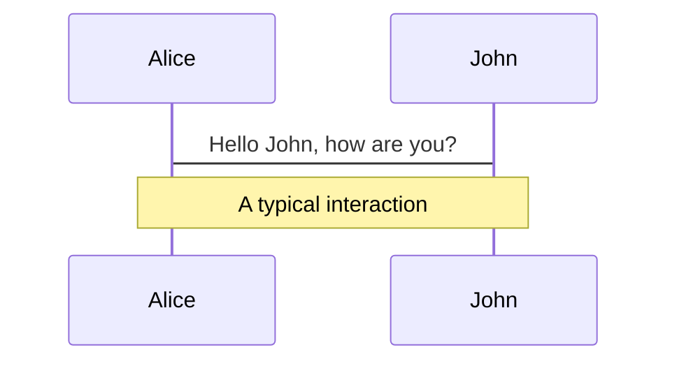
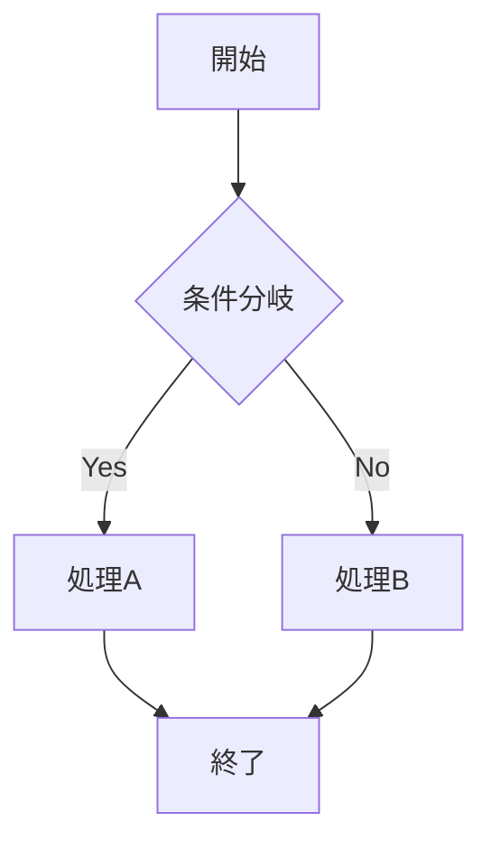
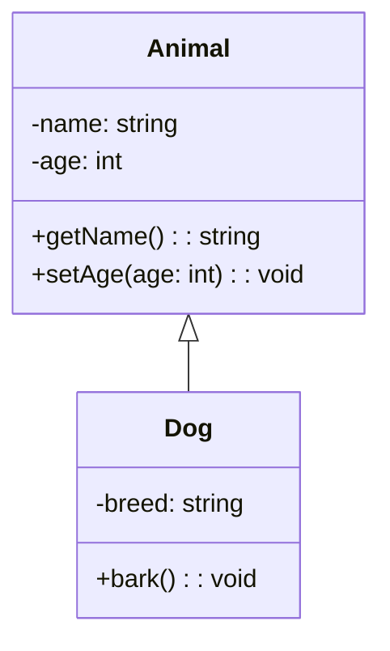
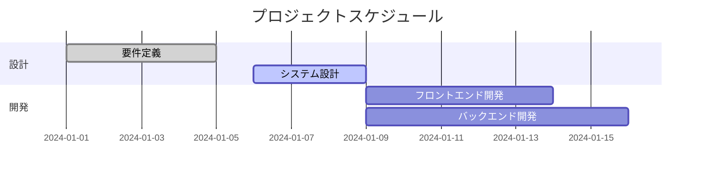
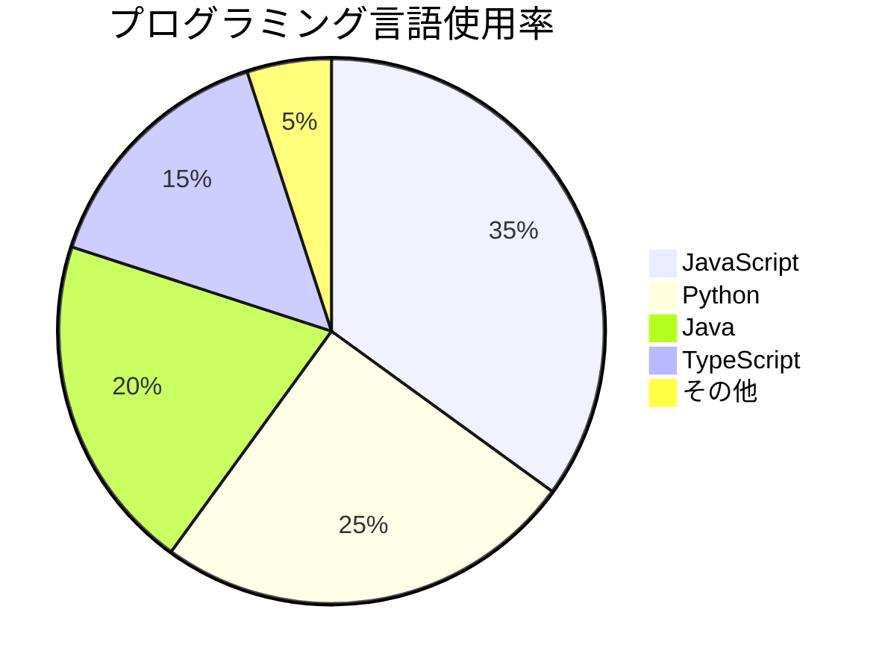
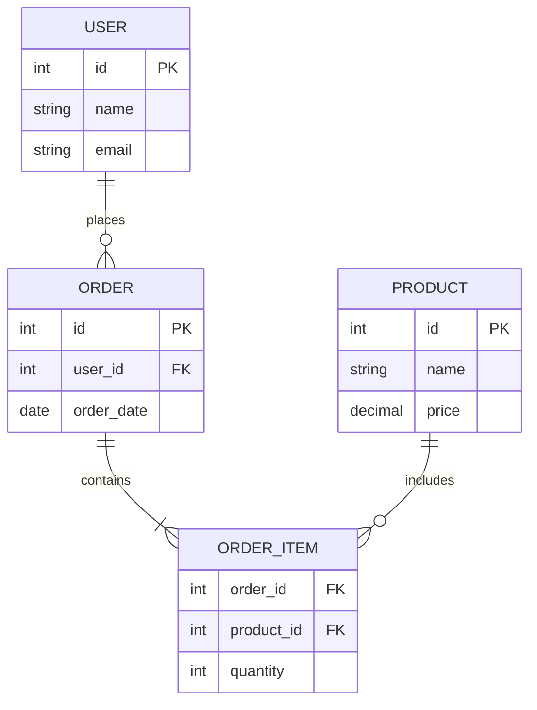
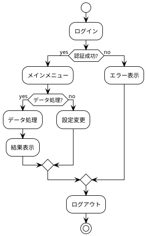
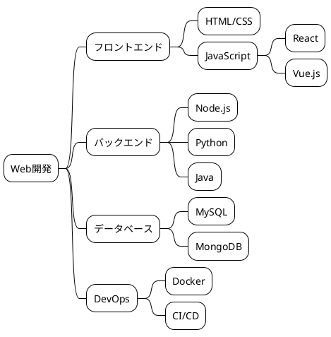
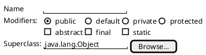

<div class="absolute top-10 shadow">
  <span class="font-700">
    Apple Basic
  </span>
</div>

<div class="absolute bottom-10">
  <h1>Slidev with Claude Code</h1>
  <p>AIと協調してスライドを作成する方法</p>
</div>

---
layout: section
---

# Claude Code

---
layout: statement
---

# AI Agentです！！！

---
layout: fact
---

# 100%
弊社の開発エンジニアの使用率

---
layout: quote
---

<div class="absolute inset-0 z-0">
  
  <div class="absolute inset-0 bg-black bg-opacity-30"></div>
</div>

<div class="relative z-10">
  <h1>"最も強い者が生き残るのではなく、最も賢い者が生き延びるのでもない。唯一生き残ることが出来るのは、変化できる者である"</h1>
  <p>ダーウィン</p>
</div>


---

# 2ページ目

2ページ目の内容

---
src: ./pages/imported-slides.md
hide: false
---

---

# クリック内容を見てみます！

<v-click>
   <p>この要素は 1回 Right Arrow や Space キーを押すことで表示されました</p>
</v-click>

<div v-click>
  <p>この要素は 2回 Right Arrow や Space キーを押すことで表示されました</p>
</div>

<div v-click>最初のクリックアニメーション</div> <!-- 1回 Right Arrow や Space キーを押すことで表示 -->
<div v-after>最初のクリックアニメーションが発火することで発火するアニメーション</div> <!-- 1回 Right Arrow や Space キーを押すことで表示（上と同タイミング） -->

---
transition: fade
---

# 別のアイテム表示方法

<v-clicks>

- Item 1
- Item 2
- Item 3

</v-clicks>

---

# コンポーネント埋め込み

<Counter :count="10" m="t-4" />

<MyComponent />

---

# シンタックスハイライトの確認

```ts{4-}
import * from
// ES6のアロー関数
const add = (a, b) => a + b;

// Promise使用例
async function fetchData() {
  try {
    const response = await fetch('/api/data');
    const data = await response.json();
    return data;
  } catch (error) {
    console.error('Error:', error);
  }
}
```


---

# Mermaidによる図の作成

<div class="flex justify-center items-center h-full">



</div>

---

# フローチャート

<div class="flex justify-center items-center h-full">



</div>

---

# クラス図

<div class="flex justify-center items-center h-full">



</div>

---

# ガントチャート

<div class="flex justify-center items-center h-full">



</div>

---

# 円グラフ

<div class="flex justify-center items-center h-full">



</div>

---

# ER図

<div class="flex justify-center items-center h-full">



</div>

---

# PlantUML - アクティビティ図

<div class="flex justify-center items-center h-full">



</div>

---

# PlantUML - マインドマップ

<div class="flex justify-center items-center h-full">



</div>

---

# PlantUML - ワイヤーフレーム

<div class="flex justify-center items-center h-full">



</div>

---

# Iconify

<uim-rocket class="text-3xl text-orange-400 animate-ping" />

---

# YouTube埋め込み

<div class="flex justify-center items-center h-full">
  <Youtube id="umiJU89tJPs" width="800" height="450" />
</div>

---
